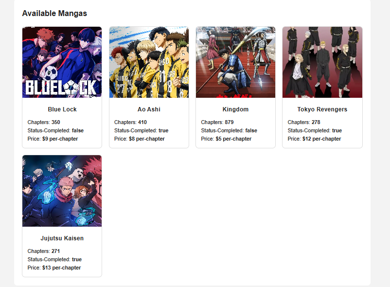
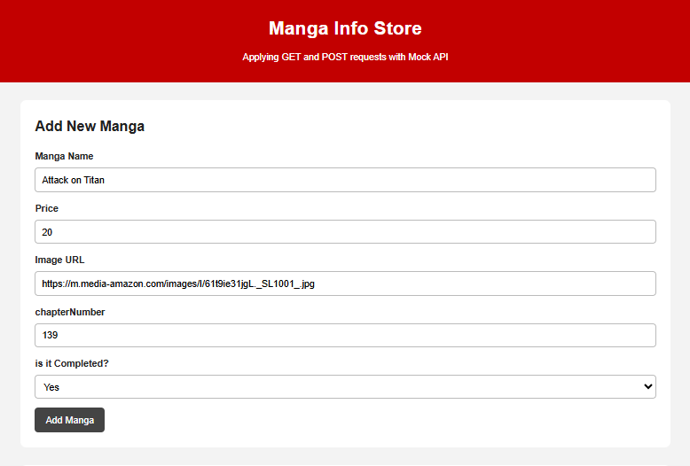
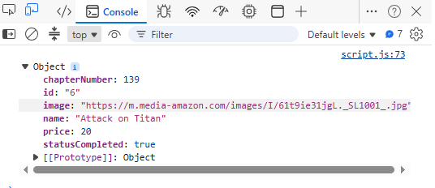
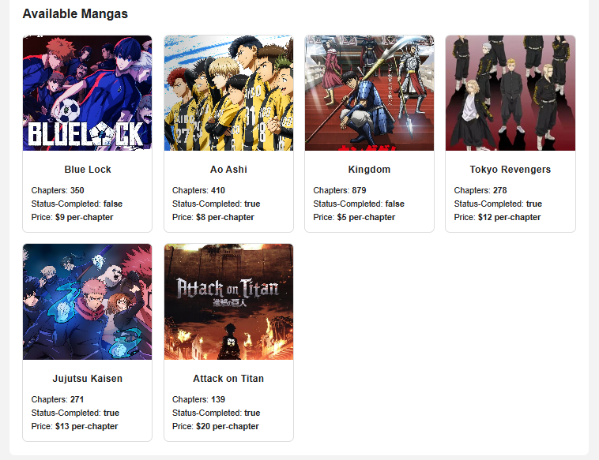

📚 Manga Info Store — GET & POST Practice

This project represents my first practical encounter with working with GET and POST requests in JavaScript.

The goal of this project was to understand how a front-end application can communicate with an external API. I used a Mock API to fetch manga data using the GET method and display it dynamically on the page. I also practiced using the POST method to add new manga items through a form and send the new data back to the API.

Through this project, I practiced:

Fetching data from an API using fetch()
Displaying API data dynamically in the DOM
Creating new objects from form input values
Sending data to an API using the POST method
Updating the page after adding new data
Handling basic errors with try...catch
Building a simple responsive card layout using HTML, CSS, and JavaScript

I will also include screenshots below to show the project interface and how the manga cards are displayed after fetching and adding data:
## 📸 Project Screenshots

Below are screenshots that demonstrate the main flow of the project.

### 1. Displaying API Data Using GET Method

This screenshot shows the data fetched from the Mock API using the **GET** method.  
After the page loads, JavaScript sends a GET request to the API, receives the manga data, and displays it dynamically inside the manga container.

---

### 2. Filling the Form and Submitting New Manga Data + Showing the New Manga Data in the Browser Console

This screenshot shows the form after filling in the manga information.  
When the submit button is pressed, the form submit event listener is activated. JavaScript collects the input values, creates a new manga object, and sends it to the API using the **POST** method.

---

### 3. Displaying the Newly Added Manga

This screenshot shows the updated manga container after submitting the form.  
After the POST request is completed, the project fetches the API data again and displays the updated list, including the newly added manga item.

